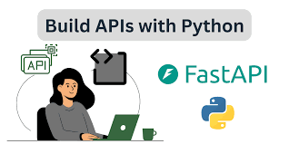

<p align="center">
  
</p>


# 💰 Cost Management API

This project is a simple **FastAPI** application for managing costs.  
It allows users to create, read, update, and delete cost records using in-memory data or a connected database (via SQLAlchemy).

---

## 📘 Project Overview

The API manages expenses and includes the following fields for each cost:

| Field | Type | Description |
|--------|------|-------------|
| `id` | Integer | Unique identifier for each cost |
| `description` | String | Short description of the cost |
| `amount` | Float | The cost amount (cannot be negative) |

---
## 🔐 JWT Authentication & Cookie Security

This project uses **JWT-based authentication** with `access` and `refresh` tokens.

- **Access Token**: Short-lived (5 minutes), used for quick authentication.
- **Refresh Token**: Long-lived (24 hours), used to renew sessions without re-login.

### Why store tokens in HttpOnly cookies?
Using `HttpOnly` and `Secure` cookies instead of localStorage or headers helps prevent **XSS (Cross-Site Scripting)** attacks, since JavaScript cannot access cookies marked as `HttpOnly`.  
It also provides better security for session handling and automatic inclusion in requests.

Cookies are set with:
- `httponly=True`
- `secure=True` *(in production)*
- `samesite="lax"`
---
## 🧩 Features

- CRUD operations for managing costs  
- Input validation using **Pydantic**  
- Optional database connection with **SQLAlchemy**  
- Example ERD diagram in `docs/`

---

## 🧱 Database Schema

The database currently contains only one table: **costs**.

### 📊 ERD Diagram


*(You can find the editable version in `docs/Costs.drawio`)*

---

## 🚀 How to Run

1. Create a virtual environment and install dependencies:
   ```bash
   pip install -r requirements.txt
