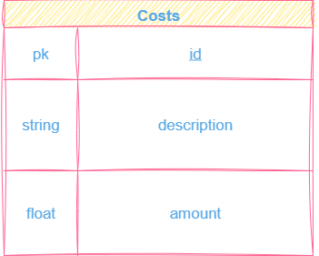

<p align="center">
  
</p>


# 💰 Cost Management API

This project is a simple **FastAPI** application for managing costs.  
It allows users to create, read, update, and delete cost records using in-memory data or a connected database (via SQLAlchemy).

---

## 📘 Project Overview

The API manages expenses and includes the following fields for each cost:

| Field | Type | Description |
|--------|------|-------------|
| `id` | Integer | Unique identifier for each cost |
| `description` | String | Short description of the cost |
| `amount` | Float | The cost amount (cannot be negative) |

---

## 🧩 Features

- CRUD operations for managing costs  
- Input validation using **Pydantic**  
- Optional database connection with **SQLAlchemy**  
- Example ERD diagram in `docs/`

---

## 🧱 Database Schema

The database currently contains only one table: **costs**.

### 📊 ERD Diagram



*(You can find the editable version in `docs/Costs.drawio`)*

---

## 🚀 How to Run

1. Create a virtual environment and install dependencies:
   ```bash
   pip install -r requirements.txt
